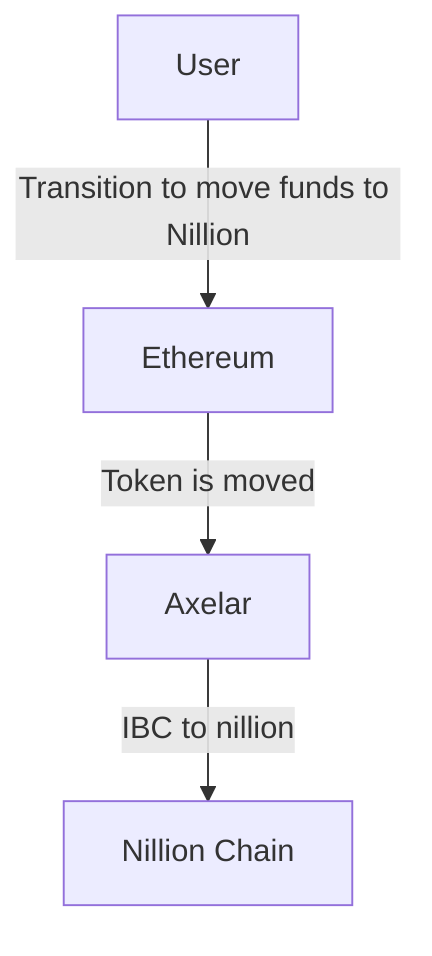
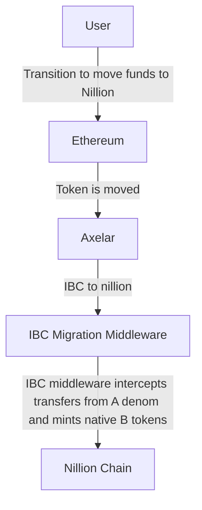
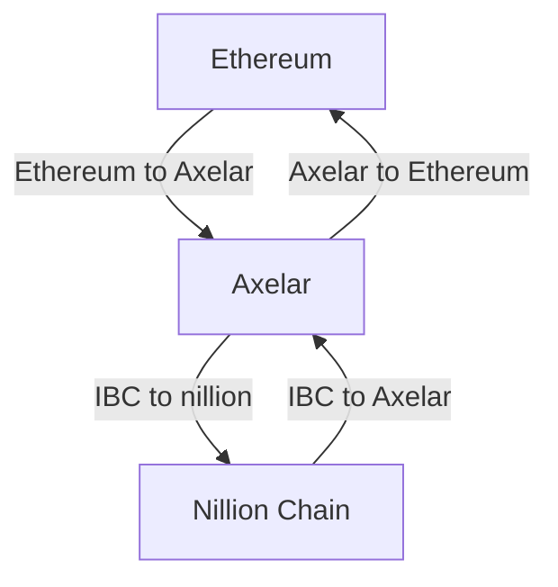

# Nillion Eth Token Communication

Nillion is launching a chain with the Cosmos SDK while already having launched a token on mainnet Ethereum. They have minted 25% of their supply on maninnet ethereum and plan on minting the rest (75%) on their Cosmos L1. This document proposes a design by Binary Builders that will allow the migration and unification of the previously minted tokens on Ethereum to the Cosmos L1 chain.

## Bridges

Axelar is the chosen partner for this project to communicate with Ethereum. This is due to Axelar’s production readiness and interoperability features that meet the requirements of this design.

#### There will be two user flows in this design

1. The swap of Ethereum mainnet nillion via Axelar with native cosmos unillion
2. The sending of native cosmos unillion to Ethereum mainnet

### Migration Flow

The Migration flow will be considered a unidirectional flow (functionality enabled via IBC middleware described below). Note, this is a standard IBC channel but we will disallow transfers returning to ethereum through this bridge with the following steps:

A user will broadcast their transaction to move their funds. In doing so the token on mainnet Ethereum will be moved through Axelar. When the token arrives at the Nillion chain we will not put the IBC token into the user's wallet. Instead we will mint the native token (unillion) to the user. With this token they will be able to stake and pay for fees on the chain.

### Implementation

This implementation will utilize the concept of IBC middleware, which will allow the interception of incoming IBC transfers and enable the functional equivalent of burning the Ethereum nil token and the minting of native unillion to the user.

### IBC Migration Middleware

The IBC middleware will intercept incoming IBC transfers to the destination chain (Nillion) and check that the denom (source chain) is A -> D -> B. If so, the typical IBC vouchers will not be minted (effectively burning the Eth Nil token) and native unillion tokens will be minted to the user. When the denom is from another source chain, IBC transfers will continue as normal.

### Mainnet Flow

The mainnet flow utilizes a standard bidirectional IBC transfer channel flow. It will be the bridge used to go back and forth to ethereum with the nillion token minted on the cosmos L1. This will be a wrapped token on the Ethereum <> Axelar end. This bridge will be integrated into ibc.fun and all other pages. This is done with the goal of creating a single representation of the Nillion token.

